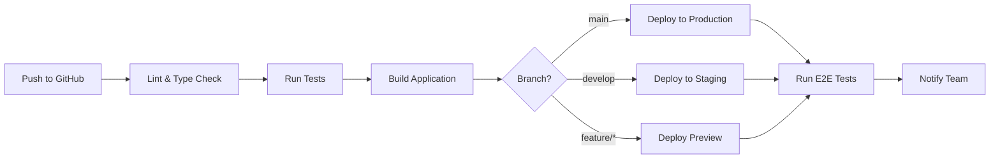

# CI/CD Pipeline Setup Guide

This guide explains how to set up a complete CI/CD pipeline for your Crypto Brokerage Mini App using GitHub Actions and Vercel.

---

## Table of Contents

1. [Overview](#overview)
2. [Pipeline Architecture](#pipeline-architecture)
3. [GitHub Actions Setup](#github-actions-setup)
4. [Automated Testing](#automated-testing)
5. [Deployment Strategies](#deployment-strategies)
6. [Environment Management](#environment-management)
7. [Monitoring & Alerts](#monitoring--alerts)
8. [Best Practices](#best-practices)

---

## Overview

### What is CI/CD?

**Continuous Integration (CI)**: Automatically build and test code changes when pushed to the repository.

**Continuous Deployment (CD)**: Automatically deploy successful builds to production or staging environments.

### Benefits for Your Mini App

- **Faster Releases**: Deploy changes in minutes, not hours
- **Quality Assurance**: Catch bugs before they reach production
- **Consistency**: Every deployment follows the same process
- **Rollback Safety**: Easy to revert to previous versions
- **Team Collaboration**: Multiple developers can work simultaneously

### Our Pipeline

```
Developer Push → GitHub → CI Tests → Build → Deploy to Vercel → Verify
```

---

## Pipeline Architecture

### Workflow Stages



### Environments

| Environment | Branch | URL | Purpose |
|-------------|--------|-----|---------|
| **Production** | `main` | `your-app.vercel.app` | Live app for users |
| **Staging** | `develop` | `staging.your-app.vercel.app` | Pre-production testing |
| **Preview** | `feature/*` | `feature-xyz.your-app.vercel.app` | Feature testing |
| **Development** | Local | `localhost:3000` | Local development |

---

## GitHub Actions Setup

### Step 1: Create Workflow Directory

```bash
cd crypto-brokerage-miniapp
mkdir -p .github/workflows
```

### Step 2: Main CI/CD Workflow

Create `.github/workflows/ci-cd.yml`:

```yaml
name: CI/CD Pipeline

on:
  push:
    branches: [main, develop]
  pull_request:
    branches: [main, develop]

env:
  NODE_VERSION: '18'

jobs:
  # Job 1: Code Quality Checks
  quality:
    name: Code Quality
    runs-on: ubuntu-latest
    
    steps:
      - name: Checkout code
        uses: actions/checkout@v4

      - name: Setup Node.js
        uses: actions/setup-node@v4
        with:
          node-version: ${{ env.NODE_VERSION }}
          cache: 'npm'

      - name: Install dependencies
        run: npm ci --legacy-peer-deps

      - name: Run ESLint
        run: npm run lint

      - name: Type check
        run: npx tsc --noEmit

      - name: Check formatting
        run: npx prettier --check "**/*.{ts,tsx,js,jsx,json,md}"

  # Job 2: Unit Tests
  test:
    name: Unit Tests
    runs-on: ubuntu-latest
    needs: quality
    
    steps:
      - name: Checkout code
        uses: actions/checkout@v4

      - name: Setup Node.js
        uses: actions/setup-node@v4
        with:
          node-version: ${{ env.NODE_VERSION }}
          cache: 'npm'

      - name: Install dependencies
        run: npm ci --legacy-peer-deps

      - name: Run tests
        run: npm test -- --coverage

      - name: Upload coverage
        uses: codecov/codecov-action@v3
        with:
          files: ./coverage/coverage-final.json
          flags: unittests

  # Job 3: Build
  build:
    name: Build Application
    runs-on: ubuntu-latest
    needs: [quality, test]
    
    steps:
      - name: Checkout code
        uses: actions/checkout@v4

      - name: Setup Node.js
        uses: actions/setup-node@v4
        with:
          node-version: ${{ env.NODE_VERSION }}
          cache: 'npm'

      - name: Install dependencies
        run: npm ci --legacy-peer-deps

      - name: Build application
        run: npm run build
        env:
          NEXT_PUBLIC_URL: ${{ secrets.NEXT_PUBLIC_URL }}
          NEYNAR_API_KEY: ${{ secrets.NEYNAR_API_KEY }}
          JWT_SECRET: ${{ secrets.JWT_SECRET }}

      - name: Upload build artifacts
        uses: actions/upload-artifact@v3
        with:
          name: build
          path: .next
          retention-days: 7

  # Job 4: Deploy to Vercel
  deploy:
    name: Deploy to Vercel
    runs-on: ubuntu-latest
    needs: build
    if: github.event_name == 'push'
    
    steps:
      - name: Checkout code
        uses: actions/checkout@v4

      - name: Deploy to Vercel
        uses: amondnet/vercel-action@v25
        with:
          vercel-token: ${{ secrets.VERCEL_TOKEN }}
          vercel-org-id: ${{ secrets.VERCEL_ORG_ID }}
          vercel-project-id: ${{ secrets.VERCEL_PROJECT_ID }}
          vercel-args: ${{ github.ref == 'refs/heads/main' && '--prod' || '' }}

  # Job 5: E2E Tests (Production only)
  e2e:
    name: E2E Tests
    runs-on: ubuntu-latest
    needs: deploy
    if: github.ref == 'refs/heads/main'
    
    steps:
      - name: Checkout code
        uses: actions/checkout@v4

      - name: Setup Node.js
        uses: actions/setup-node@v4
        with:
          node-version: ${{ env.NODE_VERSION }}
          cache: 'npm'

      - name: Install dependencies
        run: npm ci --legacy-peer-deps

      - name: Install Playwright
        run: npx playwright install --with-deps

      - name: Run E2E tests
        run: npm run test:e2e
        env:
          BASE_URL: ${{ secrets.NEXT_PUBLIC_URL }}

      - name: Upload test results
        if: always()
        uses: actions/upload-artifact@v3
        with:
          name: playwright-report
          path: playwright-report/
          retention-days: 30

  # Job 6: Notify
  notify:
    name: Notify Team
    runs-on: ubuntu-latest
    needs: [deploy, e2e]
    if: always()
    
    steps:
      - name: Send Slack notification
        uses: 8398a7/action-slack@v3
        with:
          status: ${{ job.status }}
          text: 'Deployment ${{ job.status }}'
          webhook_url: ${{ secrets.SLACK_WEBHOOK }}
        if: always()
```

### Step 3: Pull Request Workflow

Create `.github/workflows/pr-checks.yml`:

```yaml
name: PR Checks

on:
  pull_request:
    types: [opened, synchronize, reopened]

jobs:
  # Validate PR
  validate:
    name: Validate PR
    runs-on: ubuntu-latest
    
    steps:
      - name: Checkout code
        uses: actions/checkout@v4

      - name: Check PR title
        uses: amannn/action-semantic-pull-request@v5
        env:
          GITHUB_TOKEN: ${{ secrets.GITHUB_TOKEN }}

      - name: Check branch name
        run: |
          BRANCH_NAME="${{ github.head_ref }}"
          if [[ ! $BRANCH_NAME =~ ^(feature|bugfix|hotfix|refactor)/.+ ]]; then
            echo "Branch name must start with feature/, bugfix/, hotfix/, or refactor/"
            exit 1
          fi

  # Run all checks
  checks:
    name: Run Checks
    uses: ./.github/workflows/ci-cd.yml
    secrets: inherit

  # Deploy preview
  preview:
    name: Deploy Preview
    runs-on: ubuntu-latest
    needs: checks
    
    steps:
      - name: Checkout code
        uses: actions/checkout@v4

      - name: Deploy preview
        uses: amondnet/vercel-action@v25
        id: deploy-preview
        with:
          vercel-token: ${{ secrets.VERCEL_TOKEN }}
          vercel-org-id: ${{ secrets.VERCEL_ORG_ID }}
          vercel-project-id: ${{ secrets.VERCEL_PROJECT_ID }}
          github-comment: true

      - name: Comment preview URL
        uses: actions/github-script@v6
        with:
          script: |
            github.rest.issues.createComment({
              issue_number: context.issue.number,
              owner: context.repo.owner,
              repo: context.repo.repo,
              body: '🚀 Preview deployed to: ${{ steps.deploy-preview.outputs.preview-url }}'
            })
```

### Step 4: Release Workflow

Create `.github/workflows/release.yml`:

```yaml
name: Release

on:
  push:
    tags:
      - 'v*'

jobs:
  release:
    name: Create Release
    runs-on: ubuntu-latest
    
    steps:
      - name: Checkout code
        uses: actions/checkout@v4
        with:
          fetch-depth: 0

      - name: Generate changelog
        id: changelog
        uses: metcalfc/changelog-generator@v4.1.0
        with:
          myToken: ${{ secrets.GITHUB_TOKEN }}

      - name: Create Release
        uses: actions/create-release@v1
        env:
          GITHUB_TOKEN: ${{ secrets.GITHUB_TOKEN }}
        with:
          tag_name: ${{ github.ref }}
          release_name: Release ${{ github.ref }}
          body: ${{ steps.changelog.outputs.changelog }}
          draft: false
          prerelease: false

      - name: Notify team
        run: echo "Release created!"
```

---

## Automated Testing

### Step 1: Install Testing Dependencies

```bash
npm install --save-dev \
  @testing-library/react \
  @testing-library/jest-dom \
  @testing-library/user-event \
  jest \
  jest-environment-jsdom \
  @playwright/test
```

### Step 2: Jest Configuration

Create `jest.config.js`:

```javascript
const nextJest = require('next/jest')

const createJestConfig = nextJest({
  dir: './',
})

const customJestConfig = {
  setupFilesAfterEnv: ['<rootDir>/jest.setup.js'],
  testEnvironment: 'jest-environment-jsdom',
  moduleNameMapper: {
    '^@/(.*)$': '<rootDir>/$1',
  },
  collectCoverageFrom: [
    'app/**/*.{js,jsx,ts,tsx}',
    'components/**/*.{js,jsx,ts,tsx}',
    'lib/**/*.{js,jsx,ts,tsx}',
    '!**/*.d.ts',
    '!**/node_modules/**',
    '!**/.next/**',
  ],
  coverageThreshold: {
    global: {
      branches: 70,
      functions: 70,
      lines: 70,
      statements: 70,
    },
  },
}

module.exports = createJestConfig(customJestConfig)
```

Create `jest.setup.js`:

```javascript
import '@testing-library/jest-dom'
```

### Step 3: Example Unit Test

Create `components/ui/__tests__/Button.test.tsx`:

```typescript
import { render, screen, fireEvent } from '@testing-library/react'
import { Button } from '../Button'

describe('Button', () => {
  it('renders correctly', () => {
    render(<Button>Click me</Button>)
    expect(screen.getByText('Click me')).toBeInTheDocument()
  })

  it('handles click events', () => {
    const handleClick = jest.fn()
    render(<Button onClick={handleClick}>Click me</Button>)
    
    fireEvent.click(screen.getByText('Click me'))
    expect(handleClick).toHaveBeenCalledTimes(1)
  })

  it('shows loading state', () => {
    render(<Button loading>Click me</Button>)
    expect(screen.getByText('Loading...')).toBeInTheDocument()
  })

  it('applies correct variant classes', () => {
    const { container } = render(<Button variant="primary">Click me</Button>)
    expect(container.firstChild).toHaveClass('bg-blue-600')
  })
})
```

### Step 4: Playwright E2E Tests

Create `playwright.config.ts`:

```typescript
import { defineConfig, devices } from '@playwright/test'

export default defineConfig({
  testDir: './e2e',
  fullyParallel: true,
  forbidOnly: !!process.env.CI,
  retries: process.env.CI ? 2 : 0,
  workers: process.env.CI ? 1 : undefined,
  reporter: 'html',
  use: {
    baseURL: process.env.BASE_URL || 'http://localhost:3000',
    trace: 'on-first-retry',
    screenshot: 'only-on-failure',
  },
  projects: [
    {
      name: 'chromium',
      use: { ...devices['Desktop Chrome'] },
    },
    {
      name: 'Mobile Chrome',
      use: { ...devices['Pixel 5'] },
    },
    {
      name: 'Mobile Safari',
      use: { ...devices['iPhone 12'] },
    },
  ],
  webServer: {
    command: 'npm run dev',
    url: 'http://localhost:3000',
    reuseExistingServer: !process.env.CI,
  },
})
```

Create `e2e/app.spec.ts`:

```typescript
import { test, expect } from '@playwright/test'

test.describe('Crypto Brokerage App', () => {
  test('should load home page', async ({ page }) => {
    await page.goto('/')
    await expect(page.locator('h1')).toContainText('Crypto Brokerage')
  })

  test('should navigate to markets', async ({ page }) => {
    await page.goto('/')
    await page.click('text=Markets')
    await expect(page).toHaveURL('/markets')
    await expect(page.locator('input[placeholder*="Search"]')).toBeVisible()
  })

  test('should display portfolio', async ({ page }) => {
    await page.goto('/portfolio')
    await expect(page.locator('text=Portfolio Value')).toBeVisible()
  })

  test('should show market data', async ({ page }) => {
    await page.goto('/markets')
    await expect(page.locator('text=BTC')).toBeVisible()
    await expect(page.locator('text=ETH')).toBeVisible()
  })

  test('should be mobile responsive', async ({ page }) => {
    await page.setViewportSize({ width: 375, height: 667 })
    await page.goto('/')
    
    // Check bottom navigation is visible
    await expect(page.locator('nav').last()).toBeVisible()
  })
})
```

### Step 5: Update package.json

Add test scripts to `package.json`:

```json
{
  "scripts": {
    "test": "jest",
    "test:watch": "jest --watch",
    "test:coverage": "jest --coverage",
    "test:e2e": "playwright test",
    "test:e2e:ui": "playwright test --ui"
  }
}
```

---

## Deployment Strategies

### Strategy 1: Direct Deployment (Current)

Every push to `main` deploys directly to production.

**Pros:**
- Simple and fast
- Immediate updates

**Cons:**
- No safety net
- Risky for breaking changes

### Strategy 2: Staging → Production

Use a staging environment before production.

**Workflow:**
```
feature/* → develop (staging) → main (production)
```

**Implementation:**

1. Create `develop` branch:
```bash
git checkout -b develop
git push -u origin develop
```

2. Configure Vercel:
   - Production: `main` branch
   - Preview: `develop` branch

3. Update workflow to require approval:

```yaml
deploy-production:
  name: Deploy to Production
  runs-on: ubuntu-latest
  needs: [build, test]
  if: github.ref == 'refs/heads/main'
  environment:
    name: production
    url: https://your-app.vercel.app
  
  steps:
    - name: Deploy
      # ... deployment steps
```

4. Enable branch protection:
   - GitHub → Settings → Branches
   - Add rule for `main`
   - Require pull request reviews
   - Require status checks to pass

### Strategy 3: Blue-Green Deployment

Maintain two identical production environments.

**Benefits:**
- Zero downtime
- Instant rollback
- Test in production-like environment

**Implementation with Vercel:**

Vercel automatically provides this through:
- Production deployment (blue)
- Previous deployment (green)
- Instant rollback in dashboard

### Strategy 4: Canary Deployment

Gradually roll out to users.

**Implementation:**

Use Vercel's Edge Config for feature flags:

```typescript
// lib/feature-flags.ts
import { get } from '@vercel/edge-config'

export async function isFeatureEnabled(feature: string): Promise<boolean> {
  return await get(feature) ?? false
}

// Usage in component
const showNewFeature = await isFeatureEnabled('new-trading-ui')
```

---

## Environment Management

### GitHub Secrets Setup

1. Go to GitHub → Settings → Secrets and variables → Actions
2. Add the following secrets:

| Secret Name | Description | How to Get |
|-------------|-------------|------------|
| `VERCEL_TOKEN` | Vercel API token | Vercel → Settings → Tokens |
| `VERCEL_ORG_ID` | Organization ID | `.vercel/project.json` |
| `VERCEL_PROJECT_ID` | Project ID | `.vercel/project.json` |
| `NEYNAR_API_KEY` | Neynar API key | neynar.com |
| `JWT_SECRET` | JWT secret | Generate random string |
| `NEXT_PUBLIC_URL` | App URL | Your Vercel URL |
| `SLACK_WEBHOOK` | Slack webhook URL | Slack → Apps → Incoming Webhooks |

### Get Vercel IDs

```bash
# Install Vercel CLI
npm install -g vercel

# Login
vercel login

# Link project
vercel link

# Get IDs (they're in .vercel/project.json)
cat .vercel/project.json
```

### Environment Variables per Environment

Create `.env.production`, `.env.staging`, `.env.development`:

```bash
# .env.production
NEXT_PUBLIC_URL=https://your-app.vercel.app
NEXT_PUBLIC_ENV=production

# .env.staging
NEXT_PUBLIC_URL=https://staging.your-app.vercel.app
NEXT_PUBLIC_ENV=staging

# .env.development
NEXT_PUBLIC_URL=http://localhost:3000
NEXT_PUBLIC_ENV=development
```

---

## Monitoring & Alerts

### Step 1: Vercel Integration

Vercel automatically provides:
- Deployment status
- Build logs
- Runtime logs
- Performance metrics

### Step 2: Sentry Error Tracking

```bash
npm install @sentry/nextjs
npx @sentry/wizard@latest -i nextjs
```

Add to workflow:

```yaml
- name: Create Sentry release
  uses: getsentry/action-release@v1
  env:
    SENTRY_AUTH_TOKEN: ${{ secrets.SENTRY_AUTH_TOKEN }}
    SENTRY_ORG: ${{ secrets.SENTRY_ORG }}
    SENTRY_PROJECT: ${{ secrets.SENTRY_PROJECT }}
  with:
    environment: production
```

### Step 3: Slack Notifications

Create `.github/workflows/notify.yml`:

```yaml
name: Notifications

on:
  deployment_status:

jobs:
  notify:
    runs-on: ubuntu-latest
    if: github.event.deployment_status.state == 'success' || github.event.deployment_status.state == 'failure'
    
    steps:
      - name: Send Slack notification
        uses: 8398a7/action-slack@v3
        with:
          status: ${{ github.event.deployment_status.state }}
          text: |
            Deployment ${{ github.event.deployment_status.state }}
            Environment: ${{ github.event.deployment.environment }}
            URL: ${{ github.event.deployment_status.target_url }}
          webhook_url: ${{ secrets.SLACK_WEBHOOK }}
```

### Step 4: Uptime Monitoring

Use services like:
- **UptimeRobot**: Free tier available
- **Pingdom**: Comprehensive monitoring
- **Better Uptime**: Modern interface

Configure to check:
- Homepage: `https://your-app.vercel.app`
- API health: `https://your-app.vercel.app/api/health`
- Manifest: `https://your-app.vercel.app/.well-known/farcaster.json`

---

## Best Practices

### 1. Branch Strategy

Use **Git Flow**:

```
main (production)
  ↑
develop (staging)
  ↑
feature/new-feature
bugfix/fix-issue
hotfix/critical-fix
```

**Rules:**
- Never commit directly to `main`
- All changes via pull requests
- Require code reviews
- Squash commits on merge

### 2. Commit Messages

Follow **Conventional Commits**:

```
feat: add limit order support
fix: resolve portfolio calculation bug
docs: update deployment guide
refactor: simplify market data fetching
test: add unit tests for Button component
chore: update dependencies
```

### 3. Version Tagging

Use **Semantic Versioning**:

```bash
# Major release (breaking changes)
git tag v2.0.0

# Minor release (new features)
git tag v1.1.0

# Patch release (bug fixes)
git tag v1.0.1

# Push tags
git push --tags
```

### 4. Code Review Checklist

- [ ] Code follows style guide
- [ ] Tests are included
- [ ] Documentation is updated
- [ ] No console.log statements
- [ ] No hardcoded values
- [ ] Error handling is proper
- [ ] Performance is considered
- [ ] Security is reviewed

### 5. Deployment Checklist

- [ ] All tests pass
- [ ] Build succeeds
- [ ] Environment variables are set
- [ ] Database migrations run (if applicable)
- [ ] Feature flags configured
- [ ] Monitoring is active
- [ ] Rollback plan ready

### 6. Security Practices

```yaml
# Add security scanning
- name: Run security audit
  run: npm audit --production

- name: Check for secrets
  uses: trufflesecurity/trufflehog@main
  with:
    path: ./
    base: ${{ github.event.repository.default_branch }}
    head: HEAD
```

### 7. Performance Monitoring

```yaml
# Add Lighthouse CI
- name: Run Lighthouse
  uses: treosh/lighthouse-ci-action@v9
  with:
    urls: |
      https://your-app.vercel.app
    uploadArtifacts: true
```

---

## Quick Setup Commands

### Initialize CI/CD

```bash
# Create workflow directory
mkdir -p .github/workflows

# Copy workflow files (from this guide)
# Then commit and push

git add .github/
git commit -m "chore: add CI/CD workflows"
git push
```

### Add GitHub Secrets

```bash
# Using GitHub CLI
gh secret set VERCEL_TOKEN
gh secret set VERCEL_ORG_ID
gh secret set VERCEL_PROJECT_ID
gh secret set NEYNAR_API_KEY
gh secret set JWT_SECRET
gh secret set NEXT_PUBLIC_URL
```

### Test Locally

```bash
# Install Act (run GitHub Actions locally)
brew install act  # macOS
# or
curl https://raw.githubusercontent.com/nektos/act/master/install.sh | sudo bash

# Run workflow
act -j build
```

---

## Troubleshooting

### Workflow Fails

**Check logs:**
1. Go to Actions tab in GitHub
2. Click on failed workflow
3. Expand failed step
4. Read error message

**Common issues:**
- Missing secrets
- Wrong Node version
- Dependency conflicts
- Build errors

### Vercel Deployment Fails

**Check:**
1. Vercel dashboard → Deployments → Click deployment
2. View build logs
3. Check environment variables
4. Verify install command

### Tests Fail in CI but Pass Locally

**Possible causes:**
- Different Node versions
- Missing environment variables
- Timing issues in tests
- Different dependencies

**Solution:**
```yaml
# Match local environment
- name: Setup Node.js
  uses: actions/setup-node@v4
  with:
    node-version: '18.x'  # Match your local version
```

---

## Summary

Your CI/CD pipeline now includes:

✅ **Automated Testing** - Unit and E2E tests on every push
✅ **Code Quality** - Linting and type checking
✅ **Automated Deployment** - Deploy to Vercel on merge
✅ **Preview Deployments** - Test features before merging
✅ **Monitoring** - Track errors and performance
✅ **Notifications** - Team alerts on Slack
✅ **Security** - Automated vulnerability scanning
✅ **Rollback** - Easy revert to previous versions

**Next Steps:**
1. Create workflow files
2. Add GitHub secrets
3. Push to trigger first workflow
4. Monitor and iterate

Your Mini App is now enterprise-ready with a professional CI/CD pipeline! 🚀

